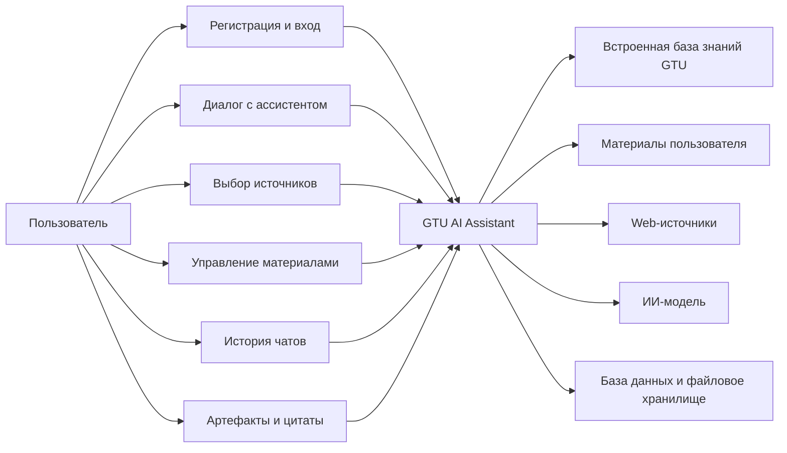
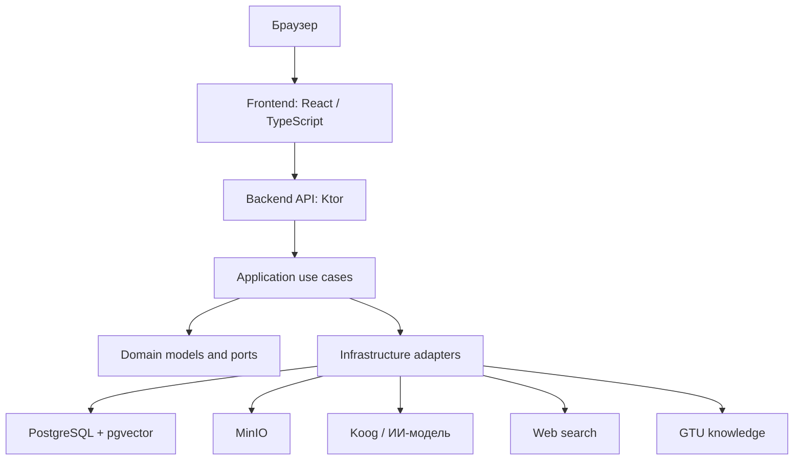
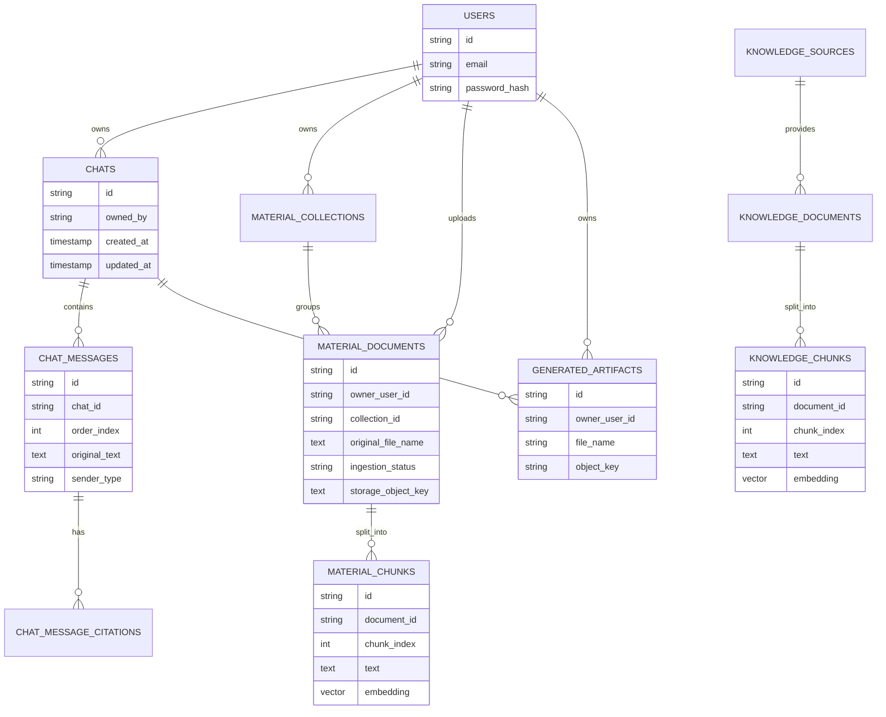

# Разработка интеллектуального ассистента для поддержки студентов и работы с учебными материалами

> Черновик описания дипломной работы. Документ отражает текущее состояние проекта и будет расширяться по мере завершения функциональности и подготовки финальной версии в формате DOCX.

## 1. ВВЕДЕНИЕ

Цифровая образовательная среда содержит большое количество разнородной информации: учебные материалы, методические документы, страницы университета, справочные данные, файлы курсов и индивидуальные конспекты студентов. При традиционном подходе пользователь сам ищет нужный документ, открывает его, просматривает текст и вручную выделяет полезные фрагменты. Такой процесс занимает время и усложняет самостоятельную работу с материалами.

Проект GTU AI Assistant разрабатывается как web-приложение интеллектуального ассистента для учебной среды. Его основная идея состоит в том, чтобы объединить диалоговый интерфейс, генерацию ответов с помощью ИИ и поиск по образовательным источникам. На текущем этапе ассистент может использовать три типа источников: заранее подготовленную внутри системы базу знаний GTU, материалы, загруженные конкретным пользователем, а также web-источники при включении соответствующего режима.

Система реализована как клиент-серверное приложение. Backend написан на Kotlin с использованием Ktor, frontend реализован на React и TypeScript. Проект еще находится в разработке, поэтому данный документ фиксирует уже реализованную основу и будет дополняться после завершения следующих этапов.

### 1.1. Актуальность работы

Актуальность работы связана с ростом роли искусственного интеллекта в образовании. Большие языковые модели позволяют создавать ассистентов, которые помогают пользователю формулировать вопросы, получать объяснения и быстрее ориентироваться в больших объемах текста. Однако для учебного заведения недостаточно обычного универсального чат-бота: образовательный ассистент должен работать с контекстом конкретной организации и с материалами пользователя.

Для GTU такая система полезна тем, что может предоставить единый интерфейс для вопросов по заранее загруженной базе знаний университета, пользовательским учебным файлам и, при необходимости, актуальной информации из сети. Это делает ассистента более прикладным: он не ограничивается общими знаниями модели, а получает возможность отвечать с опорой на источники, связанные с учебным процессом.

Также актуальна инженерная сторона работы. Проект строится не как одноразовый прототип, а как расширяемая система с модульным backend, отдельным frontend, базой данных, файловым хранилищем и инфраструктурой для поиска по текстовым фрагментам. Это позволяет в дальнейшем добавлять новые форматы материалов, роли пользователей, административные функции и более сложные сценарии работы с ИИ.

### 1.2. Цель и задачи работы

Целью дипломной работы является разработка web-приложения интеллектуального ассистента для поддержки студентов, которое обеспечивает диалоговое взаимодействие с ИИ и использует разные источники образовательного контекста.

Для достижения цели необходимо решить следующие задачи:

1. Проанализировать предметную область и определить основные сценарии использования ассистента в учебной среде.
2. Спроектировать архитектуру приложения с разделением на клиентскую часть, серверную часть, базу данных и внешние сервисы.
3. Реализовать backend API для регистрации, авторизации, работы с чатами, материалами, коллекциями и артефактами.
4. Реализовать frontend-интерфейс для диалога с ассистентом, выбора источников, просмотра истории и управления материалами.
5. Организовать хранение пользователей, чатов, сообщений, цитат, учебных материалов, фрагментов знаний и сгенерированных файлов.
6. Реализовать обработку загруженных документов: сохранение файла, извлечение текста, разбиение на фрагменты и подготовку данных для поиска.
7. Интегрировать ИИ-модель с механизмом выбора контекста из базы знаний GTU, пользовательских материалов и web-источников.
8. Обеспечить потоковую выдачу ответа, чтобы пользователь видел генерацию без ожидания полного завершения запроса.
9. Подготовить контейнеризированную среду запуска приложения.
10. Описать текущие результаты и ограничения системы для дальнейшего оформления дипломной работы.

### 1.3. Практическая значимость

Практическая значимость проекта заключается в создании основы для образовательного ассистента, который может использоваться студентом как персональный помощник при работе с учебной информацией. Пользователь получает возможность задавать вопросы естественным языком и выбирать, какие источники должны участвовать в подготовке ответа.

Особенно важна поддержка разных источников знаний. Встроенная база GTU доступна всем пользователям и может содержать общие сведения, связанные с университетом. Пользовательские материалы образуют персональное пространство студента и не смешиваются с файлами других пользователей. Web-источники расширяют возможности ассистента в тех случаях, когда локальных данных недостаточно или вопрос требует более актуальной информации.

С инженерной точки зрения проект демонстрирует применение Clean Architecture, DDD, hexagonal architecture, JWT-аутентификации, PostgreSQL, pgvector, MinIO, Docker и потокового взаимодействия между клиентом и сервером. Эти решения повышают практическую ценность работы, потому что система может развиваться дальше без полной переработки архитектуры.

## 2. Анализ предметной области и UML-проектирование

Предметная область проекта находится на пересечении образовательных информационных систем и ИИ-ассистентов. Система должна не только передавать запрос пользователя языковой модели, но и управлять источниками данных, правами доступа, историей диалогов и результатами обработки документов.

В рамках текущей версии основное внимание уделено студенту как конечному пользователю. Сценарии администратора, преподавателя, управления курсами и модерации источников пока не рассматриваются как завершенная функциональность, но архитектура оставляет возможность добавить их позже.

### 2.1. Обзор предметной области

В образовательных системах можно выделить несколько типов данных, с которыми работает пользователь:

1. Общие сведения учебного заведения: справочная информация, страницы сайта, правила, описания подразделений и другие материалы, заранее доступные в системе.
2. Персональные учебные материалы: конспекты, PDF, DOCX, Markdown и текстовые файлы, которые загружает сам пользователь.
3. Внешняя информация: web-источники, которые могут понадобиться для вопросов, выходящих за пределы локальной базы.
4. История взаимодействия: предыдущие чаты, сообщения, ответы, цитаты и созданные артефакты.

GTU AI Assistant должен объединять эти данные в одном сценарии. Пользователь задает вопрос, выбирает источники, а система подготавливает контекст для ИИ-модели. Если выбрана база GTU, выполняется поиск по заранее сохраненным общим данным. Если выбраны материалы пользователя, система ищет по фрагментам загруженных документов только в рамках его учетной записи. Если включен web-поиск, ассистент может обратиться к внешним источникам.

Такой подход соответствует модели Retrieval-Augmented Generation. Сначала система ищет релевантные фрагменты, затем передает их языковой модели вместе с вопросом и историей диалога. Это снижает зависимость ответа от общих знаний модели и позволяет использовать данные, которые находятся внутри приложения.

### 2.2. Обоснование технологического стека

Backend реализован на Kotlin, потому что этот язык сочетает строгую типизацию, удобную работу с асинхронностью через корутины и совместимость с JVM-экосистемой. Для HTTP API используется Ktor: он подходит для легковесных серверных приложений, поддерживает маршрутизацию, авторизацию, JSON-сериализацию и потоковую передачу данных.

Для разделения бизнес-логики и инфраструктуры используются Clean Architecture и hexagonal architecture. Доменный и прикладной слои работают через порты, а конкретные реализации базы данных, хранилища файлов и ИИ-интеграций находятся во внешнем слое. Ошибки в use case и портах описываются через `Either`, что делает результат операции явным и уменьшает зависимость от исключений.

PostgreSQL выбран как основная база данных для структурированных сущностей: пользователей, чатов, сообщений, материалов, источников знаний и артефактов. Расширение pgvector используется для хранения embedding-векторов текстовых фрагментов. MinIO применяется для объектного хранения файлов, потому что сами документы и артефакты удобнее хранить отдельно от их метаданных.

ИИ-часть использует Koog и OpenAI-совместимый клиент. Для извлечения текста из документов применяются PDFBox и Apache POI. Frontend построен на React, TypeScript и Vite; для серверного состояния используется TanStack React Query, для состояния сессии - Zustand, для форм - React Hook Form, для вывода Markdown - React Markdown.

Docker Compose используется для локального запуска всей системы: backend, frontend, PostgreSQL с pgvector, MinIO и вспомогательный сервис agent_space запускаются как отдельные контейнеры.

### 2.3. Диаграмма вариантов использования (Use Case)

Основной пользователь системы - студент или другой участник учебного процесса, работающий через web-интерфейс. Внешними участниками для системы являются ИИ-модель, web-источники, база данных и файловое хранилище.

Основные варианты использования:

1. Регистрация и авторизация.
2. Создание нового чата.
3. Продолжение существующего диалога.
4. Просмотр и удаление истории чатов.
5. Выбор источников ответа: база GTU, материалы пользователя, web.
6. Загрузка и скачивание учебных материалов.
7. Создание и удаление коллекций материалов.
8. Получение потокового ответа ассистента.
9. Просмотр цитат и сгенерированных артефактов.

Диаграмма показывает только текущие пользовательские сценарии. В дальнейшем она может быть расширена ролями администратора или преподавателя, если в проект будут добавлены управление источниками GTU, курсами или пользователями.

## 3. Архитектура системы

GTU AI Assistant построен как многомодульное клиент-серверное приложение. Frontend отвечает за взаимодействие с пользователем, backend выполняет сценарии приложения, PostgreSQL хранит структурированные данные и векторные фрагменты, MinIO хранит файлы, а ИИ-интеграция формирует ответы на основе подготовленного контекста.

### 3.1. Общая клиент-серверная архитектура

Клиентская часть отправляет запросы к backend API и получает данные в формате JSON или NDJSON. Обычные операции, например вход, список чатов или список материалов, выполняются через стандартные HTTP-запросы. Генерация ответа ассистента выполняется потоково: backend отправляет статусы, отдельные фрагменты текста и финальное состояние чата.

Типовой сценарий запроса к ассистенту состоит из следующих шагов:

1. Frontend отправляет текст сообщения, выбранные источники и идентификаторы выбранных материалов или коллекций.
2. Backend проверяет пользователя по JWT и преобразует запрос в команду use case.
3. Прикладной слой запрашивает релевантный контекст у соответствующих источников.
4. Инфраструктурный слой вызывает ИИ-модель.
5. Ответ, цитаты и возможные артефакты сохраняются и возвращаются клиенту.

Такое разделение позволяет независимо изменять интерфейс, логику поиска, способ хранения файлов и конкретную ИИ-модель.

### 3.2. Архитектура серверной части

Серверная часть разделена на Gradle-модули:

1. `backend/domain` - доменные модели, value objects, входящие и исходящие порты.
2. `backend/application` - реализация use case и координация сценариев.
3. `backend/presentation` - Ktor API, DTO и преобразование HTTP-запросов в команды.
4. `backend/infrastructure` - адаптеры PostgreSQL, MinIO, безопасности, поиска и ИИ.
5. `backend/app` - конфигурация приложения, сборка зависимостей и запуск сервера.
6. `shared/api-models` - общие модели API-контракта.

Основные backend-сценарии текущей версии:

1. регистрация и вход пользователя;
2. создание, продолжение, получение и удаление чатов;
3. генерация обычных и потоковых ответов;
4. выбор источников ответа;
5. загрузка, скачивание и удаление материалов;
6. создание, просмотр и удаление коллекций;
7. сохранение цитат и артефактов;
8. поиск по встроенной базе GTU, материалам пользователя и web-источникам.

Ключевой принцип серверной архитектуры - зависимость внутрь. Доменный слой не знает о Ktor, Exposed, PostgreSQL, MinIO или конкретном ИИ-клиенте. Инфраструктурные детали подключаются через порты, поэтому отдельные адаптеры можно заменить без изменения основной бизнес-логики.

### 3.3. Архитектура клиентской части

Frontend является одностраничным приложением. Он содержит экран авторизации, рабочую область чата, список диалогов, панель материалов, выбор источников и область отображения ответа.

Состояние интерфейса делится на несколько групп. Данные, получаемые с сервера, загружаются и обновляются через React Query. Состояние авторизации хранится через Zustand. Формы входа, регистрации и отправки данных обрабатываются на стороне React. Markdown-ответы ассистента отображаются как форматированный текст.

Отдельная часть клиентской логики отвечает за stream-ответы. Клиент принимает NDJSON-пакеты, различает статусы, текстовые токены и финальный объект чата. Благодаря этому пользователь видит не только итоговый ответ, но и промежуточные стадии: подготовку запроса, поиск по источникам и генерацию текста.

### 3.4. Схема базы данных

База данных разделена на несколько логических групп:

1. Пользователи и авторизация: `users`.
2. Диалоги: `chats`, `chat_messages`, `chat_message_citations`.
3. Пользовательские материалы: `material_collections`, `material_documents`, `material_chunks`, `material_ingestion_jobs`.
4. Встроенная база знаний GTU: `knowledge_sources`, `knowledge_documents`, `knowledge_chunks`, `ingestion_runs`.
5. Сгенерированные файлы: `generated_artifacts`.

`material_chunks` и `knowledge_chunks` хранят текстовые фрагменты и embedding-векторы. Разница между ними принципиальная: `material_chunks` относятся к документам конкретного пользователя, а `knowledge_chunks` относятся к общей базе знаний системы и могут использоваться всеми пользователями.

Такая схема поддерживает текущую функциональность и оставляет место для дальнейшего расширения: курсов, ролей, преподавателей, административного управления источниками GTU и дополнительных типов учебных материалов.

## 4. Используемые технологии

В проекте используется набор технологий, который можно разделить на несколько групп: backend-разработка, frontend-разработка, хранение данных, ИИ-интеграция, обработка документов, безопасность, контейнеризация и архитектурные подходы.

### 4.1. Языки программирования и платформы

1. Kotlin - основной язык серверной части приложения.
2. TypeScript - основной язык клиентской части.
3. JavaScript / JSX / TSX - используется в React-компонентах и сборке frontend.
4. Python - используется во вспомогательном сервисе `agent_space`.
5. JVM / Java 21 - платформа выполнения backend-приложения.
6. Node.js 22 - платформа сборки frontend-приложения и часть окружения `agent_space`.

### 4.2. Backend-технологии

1. Ktor - web-фреймворк для реализации HTTP API.
2. Ktor Netty - серверный runtime для запуска backend.
3. Ktor Content Negotiation - обработка JSON-запросов и ответов.
4. Ktor Authentication и Ktor JWT - защита API через JWT-аутентификацию.
5. Ktor Client CIO - HTTP-клиент для обращения к внешним сервисам.
6. Kotlin Coroutines - асинхронное выполнение операций.
7. Kotlinx Serialization - сериализация и десериализация JSON.
8. Arrow Core - функциональная обработка результатов и ошибок через `Either`.
9. Koin - внедрение зависимостей и сборка модулей приложения.
10. Logback - логирование backend-приложения.
11. Log4j-to-SLF4J - мост для совместимости логирования.
12. Gradle Kotlin DSL - сборка и конфигурация многомодульного проекта.

### 4.3. Frontend-технологии

1. React - библиотека для построения пользовательского интерфейса.
2. React DOM - рендеринг React-приложения в браузере.
3. TypeScript - типизация клиентского кода.
4. Vite - инструмент разработки и сборки frontend.
5. TanStack React Query - загрузка, кеширование и обновление серверных данных.
6. Zustand - хранение состояния сессии и авторизации.
7. React Hook Form - работа с формами входа, регистрации и пользовательского ввода.
8. React Markdown - отображение ответов ассистента в Markdown-формате.
9. remark-gfm - поддержка GitHub Flavored Markdown.
10. Zod - схема валидации данных на frontend-стороне.
11. lucide-react - набор иконок для интерфейса.
12. Nginx - раздача собранного frontend-приложения и проксирование запросов к backend.

### 4.4. Хранение данных и работа с базой

1. PostgreSQL - основная реляционная база данных.
2. pgvector - расширение PostgreSQL для хранения и сравнения embedding-векторов.
3. Exposed Core - типизированное описание таблиц и SQL-операций.
4. Exposed JDBC - выполнение запросов к PostgreSQL через JDBC.
5. Exposed Java Time - поддержка временных типов в таблицах.
6. PostgreSQL JDBC Driver - драйвер подключения backend к PostgreSQL.
7. Собственный тип `vector` в схеме Exposed - интеграция pgvector с Kotlin-кодом.
8. Векторный поиск по `knowledge_chunks` - поиск по встроенной базе знаний GTU.
9. Векторный поиск по `material_chunks` - поиск по материалам конкретного пользователя.
10. Индексация и хранение метаданных чатов, сообщений, цитат, материалов, коллекций и артефактов.

### 4.5. Файловое хранилище и документы

1. MinIO - объектное S3-совместимое хранилище для загруженных материалов и артефактов.
2. MinIO Java SDK - интеграция backend с объектным хранилищем.
3. Локальный режим файлового хранения - альтернативный режим хранения файлов при необходимости.
4. PDFBox - чтение PDF-файлов, извлечение текстового слоя и рендеринг страниц для OCR.
5. Apache POI OOXML - извлечение текста из DOCX-документов.
6. Tesseract OCR - распознавание текста в сканированных PDF.
7. Языки OCR `eng+rus` - текущая конфигурация распознавания английского и русского текста.
8. Поддерживаемые форматы материалов: TXT, Markdown, PDF, DOCX.
9. Механизм chunking - разбиение документов на текстовые фрагменты для поиска.
10. OCR metadata - сохранение сведений о применении OCR при обработке документа.

### 4.6. Искусственный интеллект и поиск

1. Koog - библиотека интеграции с LLM и AI-agent возможностями.
2. OpenAI-compatible LLM client - клиент для обращения к модели через OpenAI-совместимый API.
3. OpenAI-compatible embeddings API - режим получения embedding-векторов через внешний API.
4. Hashing embeddings - локальный режим формирования embedding-векторов без внешнего embedding API.
5. RAG - Retrieval-Augmented Generation, то есть генерация ответа с предварительным поиском контекста.
6. Встроенная база знаний GTU - заранее подготовленные общие данные системы, доступные всем пользователям.
7. Поиск по материалам пользователя - персональный источник данных, ограниченный владельцем документов.
8. Web search mode - обращение к web-источникам при включенном режиме поиска.
9. Jsoup - загрузка и разбор HTML-страниц для web/RAG-сценариев.
10. Sitemap/robots-настройки - использование `sitemap.xml` и `robots.txt` при загрузке страниц GTU.
11. Потоковая генерация ответов - передача токенов ответа по мере генерации.
12. NDJSON stream - формат потоковой передачи статусов, токенов и финального результата.
13. Цитирование источников - сохранение ссылок, фрагментов и типа источника в сообщениях.
14. Генерация артефактов - создание скачиваемых файлов, связанных с ответом ассистента.

### 4.7. Безопасность и авторизация

1. JWT - механизм авторизации пользователей.
2. java-jwt - библиотека выпуска и проверки JWT-токенов.
3. Argon2id - алгоритм хеширования пользовательских паролей.
4. argon2-jvm - библиотека для хеширования и проверки паролей.
5. Изоляция пользовательских данных - чаты, материалы и коллекции привязаны к конкретному пользователю.
6. Проверка доступа к материалам и артефактам - пользователь может работать только со своими объектами.
7. Content Security Policy для HTML-артефактов - ограничение поведения отображаемых HTML-файлов.
8. Отдельная сеть `agent_space_network` - сетевое отделение вспомогательного сервиса.
9. Ограничения контейнера `agent_space` - `cap_drop`, `no-new-privileges`, лимиты CPU, памяти и процессов.

### 4.8. Контейнеризация и инфраструктура запуска

1. Docker - контейнеризация backend, frontend и вспомогательных сервисов.
2. Docker Compose - запуск всей системы одной конфигурацией.
3. Multi-stage Docker build для backend - отдельная стадия сборки Gradle и runtime-образ.
4. Multi-stage Docker build для frontend - сборка через Node.js и запуск через Nginx.
5. Образ `pgvector/pgvector:pg16` - PostgreSQL с предустановленным расширением pgvector.
6. Образ `minio/minio` - объектное хранилище.
7. Образ `eclipse-temurin:21-jre` - runtime для backend.
8. Образ `gradle:8.14.3-jdk21` - сборка backend.
9. Образ `node:22-alpine` - сборка frontend.
10. Образ `nginx:1.29-alpine` - запуск frontend.
11. Healthcheck для PostgreSQL, MinIO и agent_space - проверка готовности сервисов.
12. Docker volumes `postgres_data` и `minio_data` - постоянное хранение данных БД и файлов.
13. Environment variables - настройка режимов AI, RAG, базы данных, MinIO, OCR и agent_space.
14. Nginx reverse proxy - проксирование `/api/` и `/health` к backend.

### 4.9. Вспомогательный сервис agent_space

1. Python HTTP-сервис - отдельный сервис для изолированного выполнения задач.
2. Поддержка режимов выполнения shell, Python и Node.js.
3. Временная рабочая директория на каждый запуск.
4. Автоматическое удаление рабочей директории после выполнения.
5. Ограничение размера запроса, времени выполнения, вывода и размера артефактов.
6. Поддержка возвращаемых артефактов в base64.
7. Набор системных утилит для работы с архивами, OCR, изображениями, видео, SQLite и документами.
8. Python-библиотеки для анализа данных и документов: pandas, numpy, scipy, scikit-learn, matplotlib, seaborn, plotly, openpyxl, duckdb, python-docx, pdfplumber, reportlab, weasyprint и другие.
9. Node.js-инструменты: TypeScript, ts-node, prettier, eslint.

### 4.10. Архитектурные и инженерные подходы

1. Clean Architecture - разделение домена, сценариев, интерфейсов и инфраструктуры.
2. Hexagonal Architecture - взаимодействие через входящие и исходящие порты.
3. DDD - использование доменных моделей, value objects и агрегатов.
4. Ports and Adapters - изоляция бизнес-логики от конкретных технологий.
5. Multimodule project - разделение backend на `domain`, `application`, `presentation`, `infrastructure`, `app`.
6. Shared API models - общий модуль DTO для согласования контракта API.
7. REST API - основной стиль взаимодействия frontend и backend.
8. Streaming API - отдельные endpoint-ы для потоковой генерации.
9. Functional error handling - явные типы ошибок через `Either`.
10. Dependency Injection - сборка зависимостей через Koin.
11. RAG pipeline - поиск контекста перед генерацией ответа.
12. Crawler/ingestion pipeline - загрузка, обработка и сохранение общей базы знаний.
13. Material ingestion pipeline - обработка пользовательских документов.
14. Object storage pattern - хранение файлов отдельно от метаданных.
15. User data isolation - разделение пользовательских материалов и чатов.
16. Containerized deployment - запуск компонентов в отдельных контейнерах.
17. Health checks - проверка готовности инфраструктурных сервисов.
18. Configuration via environment variables - настройка приложения без изменения кода.
