# Разработка интеллектуального ассистента для поддержки студентов и работы с учебными материалами

> Черновик описания дипломной работы. Документ отражает текущее состояние проекта и будет расширяться по мере завершения функциональности и подготовки финальной версии в формате DOCX.

## 1. ВВЕДЕНИЕ

Цифровая образовательная среда содержит большое количество разнородной информации: учебные материалы, методические документы, страницы университета, справочные данные, файлы курсов и индивидуальные конспекты студентов. При традиционном подходе пользователь сам ищет нужный документ, открывает его, просматривает текст и вручную выделяет полезные фрагменты. Такой процесс занимает время и усложняет самостоятельную работу с материалами.

Проект GTU AI Assistant разрабатывается как web-приложение интеллектуального ассистента для учебной среды. Его основная идея состоит в том, чтобы объединить диалоговый интерфейс, генерацию ответов с помощью ИИ и поиск по образовательным источникам. На текущем этапе ассистент может использовать три типа источников: заранее подготовленную внутри системы базу знаний GTU, материалы, загруженные конкретным пользователем, а также web-источники при включении соответствующего режима.

Система реализована как клиент-серверное приложение. Backend написан на Kotlin с использованием Ktor, frontend реализован на React и TypeScript. Проект еще находится в разработке, поэтому данный документ фиксирует уже реализованную основу и будет дополняться после завершения следующих этапов.

### 1.1. Актуальность работы

Актуальность работы связана с ростом роли искусственного интеллекта в образовании. Большие языковые модели позволяют создавать ассистентов, которые помогают пользователю формулировать вопросы, получать объяснения и быстрее ориентироваться в больших объемах текста. Однако для учебного заведения недостаточно обычного универсального чат-бота: образовательный ассистент должен работать с контекстом конкретной организации и с материалами пользователя.

Для GTU такая система полезна тем, что может предоставить единый интерфейс для вопросов по заранее загруженной базе знаний университета, пользовательским учебным файлам и, при необходимости, актуальной информации из сети. Это делает ассистента более прикладным: он не ограничивается общими знаниями модели, а получает возможность отвечать с опорой на источники, связанные с учебным процессом.

Также актуальна инженерная сторона работы. Проект строится не как одноразовый прототип, а как расширяемая система с модульным backend, отдельным frontend, базой данных, файловым хранилищем и инфраструктурой для поиска по текстовым фрагментам. Это позволяет в дальнейшем добавлять новые форматы материалов, роли пользователей, административные функции и более сложные сценарии работы с ИИ.

### 1.2. Цель и задачи работы

Целью дипломной работы является разработка web-приложения интеллектуального ассистента для поддержки студентов, которое обеспечивает диалоговое взаимодействие с ИИ и использует разные источники образовательного контекста.

Для достижения цели необходимо решить следующие задачи:

1. Проанализировать предметную область и определить основные сценарии использования ассистента в учебной среде.
2. Спроектировать архитектуру приложения с разделением на клиентскую часть, серверную часть, базу данных и внешние сервисы.
3. Реализовать backend API для регистрации, авторизации, работы с чатами, материалами, коллекциями и артефактами.
4. Реализовать frontend-интерфейс для диалога с ассистентом, выбора источников, просмотра истории и управления материалами.
5. Организовать хранение пользователей, чатов, сообщений, цитат, учебных материалов, фрагментов знаний и сгенерированных файлов.
6. Реализовать обработку загруженных документов: сохранение файла, извлечение текста, разбиение на фрагменты и подготовку данных для поиска.
7. Интегрировать ИИ-модель с механизмом выбора контекста из базы знаний GTU, пользовательских материалов и web-источников.
8. Обеспечить потоковую выдачу ответа, чтобы пользователь видел генерацию без ожидания полного завершения запроса.
9. Подготовить контейнеризированную среду запуска приложения.
10. Описать текущие результаты и ограничения системы для дальнейшего оформления дипломной работы.

### 1.3. Практическая значимость

Практическая значимость проекта заключается в создании основы для образовательного ассистента, который может использоваться студентом как персональный помощник при работе с учебной информацией. Пользователь получает возможность задавать вопросы естественным языком и выбирать, какие источники должны участвовать в подготовке ответа.

Особенно важна поддержка разных источников знаний. Встроенная база GTU доступна всем пользователям и может содержать общие сведения, связанные с университетом. Пользовательские материалы образуют персональное пространство студента и не смешиваются с файлами других пользователей. Web-источники расширяют возможности ассистента в тех случаях, когда локальных данных недостаточно или вопрос требует более актуальной информации.

С инженерной точки зрения проект демонстрирует применение Clean Architecture, DDD, hexagonal architecture, JWT-аутентификации, PostgreSQL, pgvector, MinIO, Docker и потокового взаимодействия между клиентом и сервером. Эти решения повышают практическую ценность работы, потому что система может развиваться дальше без полной переработки архитектуры.

## 2. Анализ предметной области и UML-проектирование

Предметная область проекта находится на пересечении образовательных информационных систем и ИИ-ассистентов. Система должна не только передавать запрос пользователя языковой модели, но и управлять источниками данных, правами доступа, историей диалогов и результатами обработки документов.

В рамках текущей версии основное внимание уделено студенту как конечному пользователю. Сценарии администратора, преподавателя, управления курсами и модерации источников пока не рассматриваются как завершенная функциональность, но архитектура оставляет возможность добавить их позже.

### 2.1. Обзор предметной области

В образовательных системах можно выделить несколько типов данных, с которыми работает пользователь:

1. Общие сведения учебного заведения: справочная информация, страницы сайта, правила, описания подразделений и другие материалы, заранее доступные в системе.
2. Персональные учебные материалы: конспекты, PDF, DOCX, Markdown и текстовые файлы, которые загружает сам пользователь.
3. Внешняя информация: web-источники, которые могут понадобиться для вопросов, выходящих за пределы локальной базы.
4. История взаимодействия: предыдущие чаты, сообщения, ответы, цитаты и созданные артефакты.

GTU AI Assistant должен объединять эти данные в одном сценарии. Пользователь задает вопрос, выбирает источники, а система подготавливает контекст для ИИ-модели. Если выбрана база GTU, выполняется поиск по заранее сохраненным общим данным. Если выбраны материалы пользователя, система ищет по фрагментам загруженных документов только в рамках его учетной записи. Если включен web-поиск, ассистент может обратиться к внешним источникам.

Такой подход соответствует модели Retrieval-Augmented Generation. Сначала система ищет релевантные фрагменты, затем передает их языковой модели вместе с вопросом и историей диалога. Это снижает зависимость ответа от общих знаний модели и позволяет использовать данные, которые находятся внутри приложения. В проекте RAG реализован не как абстрактная идея, а как отдельный pipeline: документы проходят ingestion, текст разбивается на фрагменты, для каждого фрагмента создается embedding-вектор, вектор сохраняется в PostgreSQL через pgvector, а при вопросе пользователя выполняется семантический и гибридный поиск по этим фрагментам.

### 2.2. Обоснование технологического стека

Backend реализован на Kotlin, потому что этот язык сочетает строгую типизацию, удобную работу с асинхронностью через корутины и совместимость с JVM-экосистемой. Для HTTP API используется Ktor: он подходит для легковесных серверных приложений, поддерживает маршрутизацию, авторизацию, JSON-сериализацию и потоковую передачу данных.

Для разделения бизнес-логики и инфраструктуры используются Clean Architecture и hexagonal architecture. Доменный и прикладной слои работают через порты, а конкретные реализации базы данных, хранилища файлов и ИИ-интеграций находятся во внешнем слое. Ошибки в use case и портах описываются через `Either`, что делает результат операции явным и уменьшает зависимость от исключений.

PostgreSQL выбран как основная база данных для структурированных сущностей: пользователей, чатов, сообщений, материалов, источников знаний и артефактов. Расширение pgvector используется для хранения embedding-векторов текстовых фрагментов. MinIO применяется для объектного хранения файлов, потому что сами документы и артефакты удобнее хранить отдельно от их метаданных.

ИИ-часть использует Koog и OpenAI-совместимый клиент. Для извлечения текста из документов применяются PDFBox и Apache POI. Frontend построен на React, TypeScript и Vite; для серверного состояния используется TanStack React Query, для состояния сессии - Zustand, для форм - React Hook Form, для вывода Markdown - React Markdown.

Docker Compose используется для локального запуска всей системы: backend, frontend, PostgreSQL с pgvector, MinIO, Ollama и вспомогательный сервис agent_space запускаются как отдельные контейнеры. Для векторизации в локальном окружении используется модель `bge-m3`, которая загружается в контейнер Ollama и вызывается backend через HTTP API Ollama.

### 2.3. Диаграмма вариантов использования (Use Case)

Основной пользователь системы - студент или другой участник учебного процесса, работающий через web-интерфейс. Внешними участниками для системы являются ИИ-модель, web-источники, база данных и файловое хранилище.

Основные варианты использования:

1. Регистрация и авторизация.
2. Создание нового чата.
3. Продолжение существующего диалога.
4. Просмотр и удаление истории чатов.
5. Выбор источников ответа: база GTU, материалы пользователя, web.
6. Загрузка и скачивание учебных материалов.
7. Создание и удаление коллекций материалов.
8. Получение потокового ответа ассистента.
9. Просмотр цитат и сгенерированных артефактов.

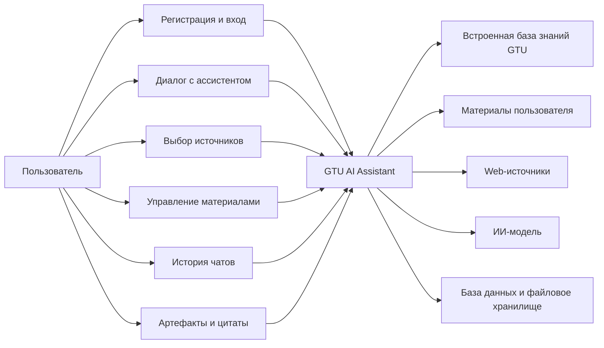

Диаграмма показывает только текущие пользовательские сценарии. В дальнейшем она может быть расширена ролями администратора или преподавателя, если в проект будут добавлены управление источниками GTU, курсами или пользователями.

## 3. Архитектура системы

GTU AI Assistant построен как многомодульное клиент-серверное приложение. Frontend отвечает за взаимодействие с пользователем, backend выполняет сценарии приложения, PostgreSQL хранит структурированные данные и векторные фрагменты, MinIO хранит файлы, а ИИ-интеграция формирует ответы на основе подготовленного контекста.

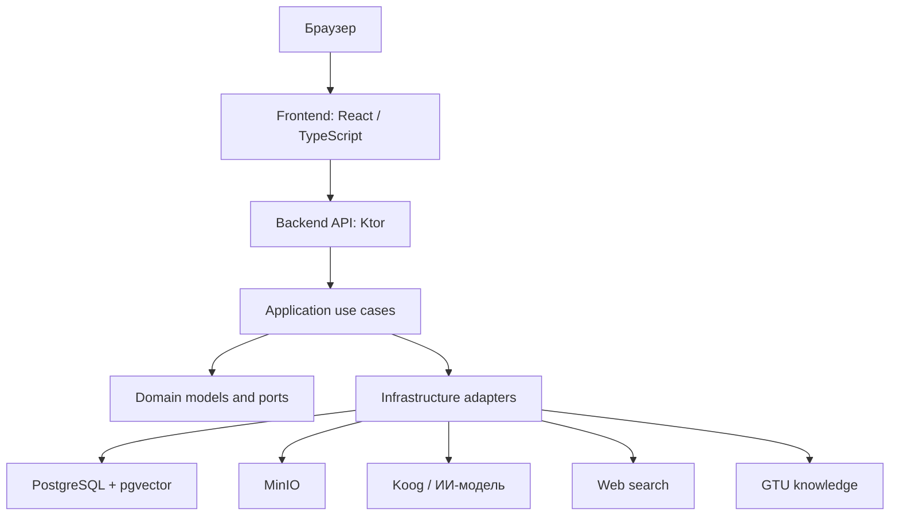

### 3.1. Общая клиент-серверная архитектура

Клиентская часть отправляет запросы к backend API и получает данные в формате JSON или NDJSON. Обычные операции, например вход, список чатов или список материалов, выполняются через стандартные HTTP-запросы. Генерация ответа ассистента выполняется потоково: backend отправляет статусы, отдельные фрагменты текста и финальное состояние чата.

Типовой сценарий запроса к ассистенту состоит из следующих шагов:

1. Frontend отправляет текст сообщения, выбранные источники и идентификаторы выбранных материалов или коллекций.
2. Backend проверяет пользователя по JWT и преобразует запрос в команду use case.
3. Прикладной слой запрашивает релевантный контекст у соответствующих источников.
4. Инфраструктурный слой вызывает ИИ-модель.
5. Ответ, цитаты и возможные артефакты сохраняются и возвращаются клиенту.

Такое разделение позволяет независимо изменять интерфейс, логику поиска, способ хранения файлов и конкретную ИИ-модель.

### 3.2. Реализация RAG-подхода и векторизации

Центральной частью интеллектуального поведения ассистента является RAG-подход. Его задача состоит в том, чтобы перед генерацией ответа найти в локальных источниках наиболее близкие к вопросу пользователя фрагменты и передать их языковой модели как разрешенный контекст. Благодаря этому ответ формируется не только на основе общих знаний LLM, а с опорой на документы GTU, загруженные пользовательские материалы и, при необходимости, web-источники.

В системе существуют два основных локальных корпуса данных для RAG:

1. Общая база знаний GTU. Она хранится в таблицах `knowledge_sources`, `knowledge_documents` и `knowledge_chunks`. Эти данные доступны всем пользователям и формируются через crawler/ingestion pipeline.
2. Пользовательские материалы. Они хранятся в таблицах `material_documents` и `material_chunks`, привязаны к `owner_user_id` и используются только владельцем документов.

Общий поток обработки выглядит следующим образом:

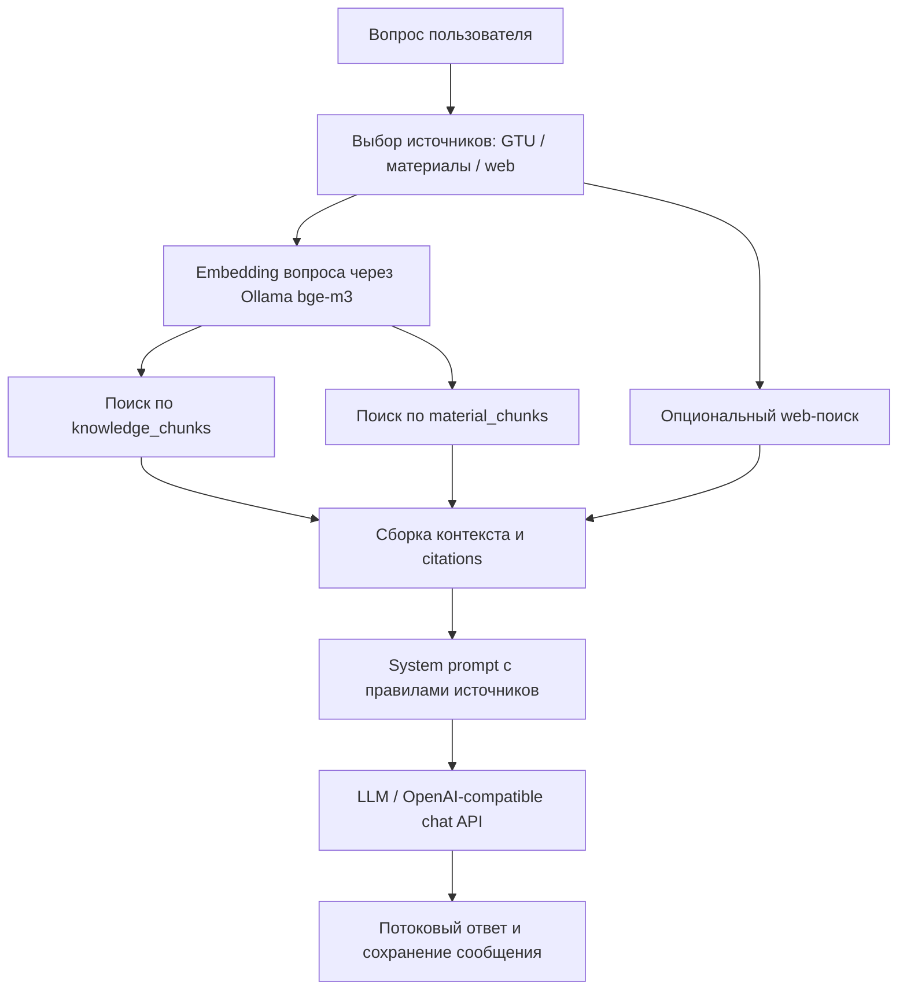

Векторизация вынесена в отдельный порт `EmbeddingPort`. Конкретная реализация выбирается через `EmbeddingPortFactory` по настройке `APP_EMBEDDING_MODE`. Поддерживаются режимы `hash`, `openai` и `ollama`, но в текущей локальной Docker-конфигурации используется именно `ollama`. Backend получает настройки из environment variables:

1. `APP_EMBEDDING_MODE=ollama` - выбор локального Ollama embedding backend.
2. `APP_EMBEDDING_BASE_URL=http://ollama:11434` - адрес контейнера Ollama внутри Docker Compose сети.
3. `APP_EMBEDDING_MODEL=bge-m3` - модель для построения embedding-векторов.
4. `APP_EMBEDDING_DIMENSIONS=1024` - ожидаемая размерность вектора для `bge-m3`.

Контейнер `ollama` запускается отдельно от backend. Дополнительный сервис `ollama-pull-bge-m3` зависит от готовности Ollama и выполняет команду `ollama pull bge-m3`. Backend стартует только после успешной загрузки модели. Это важно для воспроизводимости: при локальном запуске не требуется внешний embedding API, а векторизация выполняется внутри инфраструктуры приложения.

Реализация `OllamaEmbeddingPort` отправляет POST-запрос на endpoint `/api/embed` контейнера Ollama. В тело запроса передаются имя модели, входной текст и ожидаемая размерность. Ответ Ollama содержит массив `embeddings`; backend берет первый embedding, преобразует значения в `Float` и проверяет, что длина массива совпадает с `APP_EMBEDDING_DIMENSIONS`. Если размерность отличается, операция считается ошибочной, потому что такие векторы нельзя корректно сравнивать с уже сохраненными в pgvector.

Для пользовательских материалов pipeline начинается после загрузки файла. Документ сохраняется в MinIO, а в базе создается запись со статусом `UPLOADED`. Затем `MaterialIngestionWorker` выбирает такие документы, переводит их в статус `PROCESSING`, читает файл из объектного хранилища, извлекает текст и строит фрагменты. Для TXT и Markdown текст читается напрямую, для PDF используется PDFBox, для DOCX - Apache POI, а для сканированных PDF может применяться Tesseract OCR. После извлечения текста `MaterialChunkBuilder` делит документ на фрагменты примерно по 400 слов с overlap 75 слов, чтобы смысловые части на границах chunk-ов не терялись.

Для каждого фрагмента формируется специальный embedding input, который включает заголовок документа, путь заголовков внутри документа и сам текст фрагмента. Такой вход лучше, чем голый текст, потому что embedding получает дополнительный контекст о происхождении фрагмента. После получения вектора создается объект `MaterialChunk`, который сохраняется в `material_chunks` вместе с `owner_user_id`, `document_id`, `collection_id`, индексом фрагмента, текстом, heading path и страницами. После успешного сохранения всех chunk-ов документ переводится в статус `READY`.

Встроенная база GTU использует аналогичную идею: страницы или документы GTU сохраняются как `knowledge_documents`, а их фрагменты с embedding-векторами - как `knowledge_chunks`. Таблица содержит `title`, `url`, `text` и `embedding`, что позволяет не только искать по смысловой близости, но и формировать цитаты с названием и ссылкой на источник.

При обработке вопроса пользователя backend сначала проверяет выбранные источники. Если включена база GTU, запускается поиск через `KnowledgeSearchTool` и `SearchKnowledgePort`. Если включены материалы, запускается `UserMaterialSearchTool`, который учитывает владельца пользователя, выбранные коллекции и выбранные документы. Если включен web-режим, web-поиск выполняется не всегда, а только когда выбран web-источник и локальный результат недостаточно уверен либо вопрос выглядит зависящим от времени. Такой подход уменьшает лишние обращения к web-источникам и делает локальные знания приоритетными.

Поиск по пользовательским материалам использует pgvector непосредственно в SQL. Для вопроса строится embedding через `bge-m3`, после чего кандидаты сортируются по оператору расстояния `c.embedding <=> '[...]'::vector`. Дополнительно выбираются лексические кандидаты по совпадениям в названии документа, heading path и тексте. Затем результаты объединяются, удаляются дубликаты по `chunkId`, пересчитываются финальным скорингом и ограничиваются максимальным числом результатов.

Поиск по GTU-базе также строит embedding вопроса, но поверх семантической близости применяется гибридный скоринг. Кандидат оценивается по нескольким признакам: cosine similarity между embedding-векторами, совпадение ключевых токенов в тексте, названии и URL, recall числовых токенов, совпадение биграмм и бонус за точное совпадение запроса в названии или URL. Итоговая формула сильнее учитывает лексический сигнал, что важно для образовательных и справочных вопросов: номера, даты, названия разделов и устойчивые фразы не должны теряться из-за одной только семантической близости.

После поиска источники объединяются в единый список `AgentSource`, из которого формируются citations. В system prompt добавляются правила выбранных источников: модель должна использовать только разрешенный контекст и не делать фактические утверждения на основе общих знаний, если соответствующий источник не выбран или данных недостаточно. Для режима только пользовательских материалов отдельно задается правило: если загруженные материалы не содержат ответа, ассистент должен прямо сообщить об этом.

Итоговый контекст передается в LLM вместе с историей диалога. Ответ генерируется потоково: backend сначала отправляет статусы подготовки, поиска по GTU, проверки материалов, web-поиска и готовности контекста, затем передает токены ответа и финальное состояние чата. Сохраненные citations позволяют пользователю видеть, какие фрагменты были использованы при ответе.

Отдельно реализована защита от несоответствия embedding-профиля. `EmbeddingConfig` формирует fingerprint из режима, base URL, модели и размерности. При запуске PostgreSQL-режима сервис синхронизации сравнивает текущий fingerprint с сохраненным значением. Если профиль изменился, старые material chunks удаляются, пользовательские документы переводятся обратно в состояние для переобработки, а документы GTU удаляются для повторного ingestion. Это предотвращает ситуацию, когда в одной таблице смешиваются векторы, построенные разными моделями или с разной размерностью.

### 3.3. Архитектура серверной части

Серверная часть разделена на Gradle-модули:

1. `backend/domain` - доменные модели, value objects, входящие и исходящие порты.
2. `backend/application` - реализация use case и координация сценариев.
3. `backend/presentation` - Ktor API, DTO и преобразование HTTP-запросов в команды.
4. `backend/infrastructure` - адаптеры PostgreSQL, MinIO, безопасности, поиска и ИИ.
5. `backend/app` - конфигурация приложения, сборка зависимостей и запуск сервера.
6. `shared/api-models` - общие модели API-контракта.

Основные backend-сценарии текущей версии:

1. регистрация и вход пользователя;
2. создание, продолжение, получение и удаление чатов;
3. генерация обычных и потоковых ответов;
4. выбор источников ответа;
5. загрузка, скачивание и удаление материалов;
6. создание, просмотр и удаление коллекций;
7. сохранение цитат и артефактов;
8. поиск по встроенной базе GTU, материалам пользователя и web-источникам.

Ключевой принцип серверной архитектуры - зависимость внутрь. Доменный слой не знает о Ktor, Exposed, PostgreSQL, MinIO или конкретном ИИ-клиенте. Инфраструктурные детали подключаются через порты, поэтому отдельные адаптеры можно заменить без изменения основной бизнес-логики.

### 3.4. Архитектура клиентской части

Frontend является одностраничным приложением. Он содержит экран авторизации, рабочую область чата, список диалогов, панель материалов, выбор источников и область отображения ответа.

Состояние интерфейса делится на несколько групп. Данные, получаемые с сервера, загружаются и обновляются через React Query. Состояние авторизации хранится через Zustand. Формы входа, регистрации и отправки данных обрабатываются на стороне React. Markdown-ответы ассистента отображаются как форматированный текст.

Отдельная часть клиентской логики отвечает за stream-ответы. Клиент принимает NDJSON-пакеты, различает статусы, текстовые токены и финальный объект чата. Благодаря этому пользователь видит не только итоговый ответ, но и промежуточные стадии: подготовку запроса, поиск по источникам и генерацию текста.

### 3.5. Схема базы данных

База данных разделена на несколько логических групп:

1. Пользователи и авторизация: `users`.
2. Диалоги: `chats`, `chat_messages`, `chat_message_citations`.
3. Пользовательские материалы: `material_collections`, `material_documents`, `material_chunks`, `material_ingestion_jobs`.
4. Встроенная база знаний GTU: `knowledge_sources`, `knowledge_documents`, `knowledge_chunks`, `ingestion_runs`.
5. Сгенерированные файлы: `generated_artifacts`.

`material_chunks` и `knowledge_chunks` хранят текстовые фрагменты и embedding-векторы. Разница между ними принципиальная: `material_chunks` относятся к документам конкретного пользователя, а `knowledge_chunks` относятся к общей базе знаний системы и могут использоваться всеми пользователями.

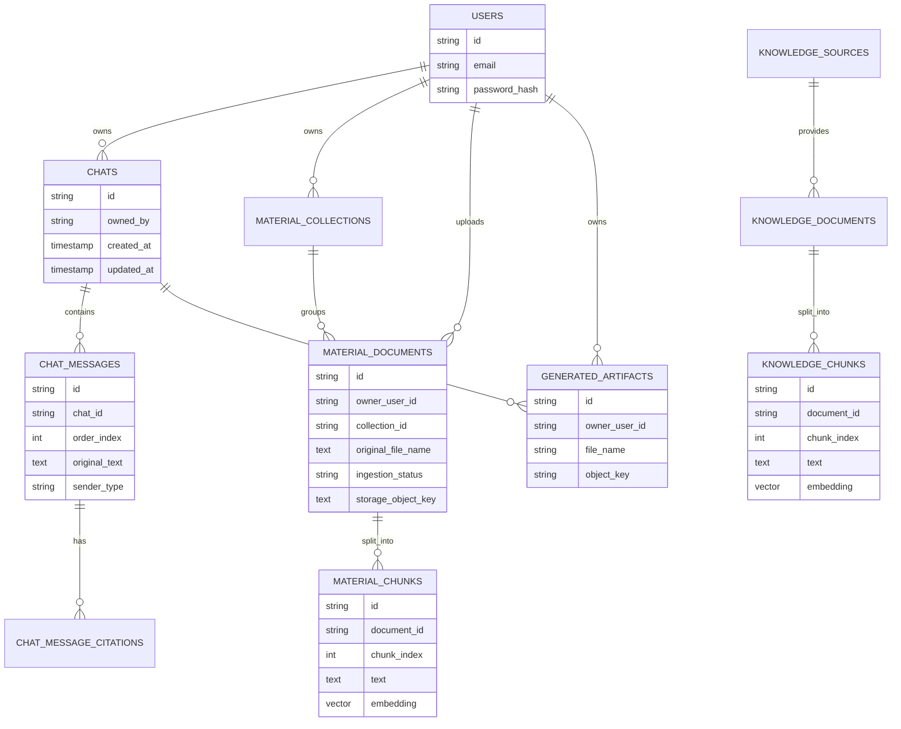

Такая схема поддерживает текущую функциональность и оставляет место для дальнейшего расширения: курсов, ролей, преподавателей, административного управления источниками GTU и дополнительных типов учебных материалов.

## 4. Используемые технологии

В проекте используется набор технологий, который можно разделить на несколько групп: backend-разработка, frontend-разработка, хранение данных, ИИ-интеграция, обработка документов, безопасность, контейнеризация и архитектурные подходы.

### 4.1. Языки программирования и платформы

1. Kotlin - основной язык серверной части приложения.
2. TypeScript - основной язык клиентской части.
3. JavaScript / JSX / TSX - используется в React-компонентах и сборке frontend.
4. Python - используется во вспомогательном сервисе `agent_space`.
5. JVM / Java 21 - платформа выполнения backend-приложения.
6. Node.js 22 - платформа сборки frontend-приложения и часть окружения `agent_space`.

### 4.2. Backend-технологии

1. Ktor - web-фреймворк для реализации HTTP API.
2. Ktor Netty - серверный runtime для запуска backend.
3. Ktor Content Negotiation - обработка JSON-запросов и ответов.
4. Ktor Authentication и Ktor JWT - защита API через JWT-аутентификацию.
5. Ktor Client CIO - HTTP-клиент для обращения к внешним сервисам.
6. Kotlin Coroutines - асинхронное выполнение операций.
7. Kotlinx Serialization - сериализация и десериализация JSON.
8. Arrow Core - функциональная обработка результатов и ошибок через `Either`.
9. Koin - внедрение зависимостей и сборка модулей приложения.
10. Logback - логирование backend-приложения.
11. Log4j-to-SLF4J - мост для совместимости логирования.
12. Gradle Kotlin DSL - сборка и конфигурация многомодульного проекта.

### 4.3. Frontend-технологии

1. React - библиотека для построения пользовательского интерфейса.
2. React DOM - рендеринг React-приложения в браузере.
3. TypeScript - типизация клиентского кода.
4. Vite - инструмент разработки и сборки frontend.
5. TanStack React Query - загрузка, кеширование и обновление серверных данных.
6. Zustand - хранение состояния сессии и авторизации.
7. React Hook Form - работа с формами входа, регистрации и пользовательского ввода.
8. React Markdown - отображение ответов ассистента в Markdown-формате.
9. remark-gfm - поддержка GitHub Flavored Markdown.
10. Zod - схема валидации данных на frontend-стороне.
11. lucide-react - набор иконок для интерфейса.
12. Nginx - раздача собранного frontend-приложения и проксирование запросов к backend.

### 4.4. Хранение данных и работа с базой

1. PostgreSQL - основная реляционная база данных.
2. pgvector - расширение PostgreSQL для хранения и сравнения embedding-векторов.
3. Exposed Core - типизированное описание таблиц и SQL-операций.
4. Exposed JDBC - выполнение запросов к PostgreSQL через JDBC.
5. Exposed Java Time - поддержка временных типов в таблицах.
6. PostgreSQL JDBC Driver - драйвер подключения backend к PostgreSQL.
7. Собственный тип `vector` в схеме Exposed - интеграция pgvector с Kotlin-кодом.
8. Оператор pgvector `<=>` - расчет расстояния между embedding-векторами при поиске по пользовательским материалам.
9. Векторный поиск по `knowledge_chunks` - поиск по встроенной базе знаний GTU.
10. Векторный поиск по `material_chunks` - поиск по материалам конкретного пользователя.
11. Гибридный скоринг - объединение семантической близости, ключевых слов, числовых токенов и фразовых совпадений.
12. Индексация и хранение метаданных чатов, сообщений, цитат, материалов, коллекций и артефактов.

### 4.5. Файловое хранилище и документы

1. MinIO - объектное S3-совместимое хранилище для загруженных материалов и артефактов.
2. MinIO Java SDK - интеграция backend с объектным хранилищем.
3. Локальный режим файлового хранения - альтернативный режим хранения файлов при необходимости.
4. PDFBox - чтение PDF-файлов, извлечение текстового слоя и рендеринг страниц для OCR.
5. Apache POI OOXML - извлечение текста из DOCX-документов.
6. Tesseract OCR - распознавание текста в сканированных PDF.
7. Языки OCR `eng+rus` - текущая конфигурация распознавания английского и русского текста.
8. Поддерживаемые форматы материалов: TXT, Markdown, PDF, DOCX.
9. Механизм chunking - разбиение документов на текстовые фрагменты для поиска.
10. OCR metadata - сохранение сведений о применении OCR при обработке документа.

### 4.6. Искусственный интеллект и поиск

1. Koog - библиотека интеграции с LLM и AI-agent возможностями.
2. OpenAI-compatible LLM client - клиент для обращения к модели через OpenAI-совместимый API.
3. Ollama embeddings API - локальное получение embedding-векторов через контейнер Ollama.
4. `bge-m3` - embedding-модель, используемая в локальном Docker-окружении для RAG-поиска.
5. OpenAI-compatible embeddings API - альтернативный режим получения embedding-векторов через внешний API.
6. Hashing embeddings - fallback-режим формирования embedding-векторов без внешнего embedding API.
7. RAG - Retrieval-Augmented Generation, то есть генерация ответа с предварительным поиском контекста.
8. Встроенная база знаний GTU - заранее подготовленные общие данные системы, доступные всем пользователям.
9. Поиск по материалам пользователя - персональный источник данных, ограниченный владельцем документов.
10. Web search mode - обращение к web-источникам при включенном режиме поиска и недостаточности локального контекста.
11. Jsoup - загрузка и разбор HTML-страниц для web/RAG-сценариев.
12. Sitemap/robots-настройки - использование `sitemap.xml` и `robots.txt` при загрузке страниц GTU.
13. Потоковая генерация ответов - передача токенов ответа по мере генерации.
14. NDJSON stream - формат потоковой передачи статусов, токенов и финального результата.
15. Цитирование источников - сохранение ссылок, фрагментов и типа источника в сообщениях.
16. Генерация артефактов - создание скачиваемых файлов, связанных с ответом ассистента.

### 4.7. Безопасность и авторизация

1. JWT - механизм авторизации пользователей.
2. java-jwt - библиотека выпуска и проверки JWT-токенов.
3. Argon2id - алгоритм хеширования пользовательских паролей.
4. argon2-jvm - библиотека для хеширования и проверки паролей.
5. Изоляция пользовательских данных - чаты, материалы и коллекции привязаны к конкретному пользователю.
6. Проверка доступа к материалам и артефактам - пользователь может работать только со своими объектами.
7. Content Security Policy для HTML-артефактов - ограничение поведения отображаемых HTML-файлов.
8. Отдельная сеть `agent_space_network` - сетевое отделение вспомогательного сервиса.
9. Ограничения контейнера `agent_space` - `cap_drop`, `no-new-privileges`, лимиты CPU, памяти и процессов.

### 4.8. Контейнеризация и инфраструктура запуска

1. Docker - контейнеризация backend, frontend и вспомогательных сервисов.
2. Docker Compose - запуск всей системы одной конфигурацией.
3. Multi-stage Docker build для backend - отдельная стадия сборки Gradle и runtime-образ.
4. Multi-stage Docker build для frontend - сборка через Node.js и запуск через Nginx.
5. Образ `pgvector/pgvector:pg16` - PostgreSQL с предустановленным расширением pgvector.
6. Образ `minio/minio` - объектное хранилище.
7. Образ `eclipse-temurin:21-jre` - runtime для backend.
8. Образ `gradle:8.14.3-jdk21` - сборка backend.
9. Образ `node:22-alpine` - сборка frontend.
10. Образ `nginx:1.29-alpine` - запуск frontend.
11. Healthcheck для PostgreSQL, MinIO и agent_space - проверка готовности сервисов.
12. Docker volumes `postgres_data` и `minio_data` - постоянное хранение данных БД и файлов.
13. Образ `ollama/ollama` - локальный сервис для запуска embedding-модели `bge-m3`.
14. Сервис `ollama-pull-bge-m3` - автоматическая загрузка модели перед стартом backend.
15. Environment variables - настройка режимов AI, RAG, базы данных, MinIO, OCR, Ollama и agent_space.
16. Nginx reverse proxy - проксирование `/api/` и `/health` к backend.

### 4.9. Вспомогательный сервис agent_space

1. Python HTTP-сервис - отдельный сервис для изолированного выполнения задач.
2. Поддержка режимов выполнения shell, Python и Node.js.
3. Временная рабочая директория на каждый запуск.
4. Автоматическое удаление рабочей директории после выполнения.
5. Ограничение размера запроса, времени выполнения, вывода и размера артефактов.
6. Поддержка возвращаемых артефактов в base64.
7. Набор системных утилит для работы с архивами, OCR, изображениями, видео, SQLite и документами.
8. Python-библиотеки для анализа данных и документов: pandas, numpy, scipy, scikit-learn, matplotlib, seaborn, plotly, openpyxl, duckdb, python-docx, pdfplumber, reportlab, weasyprint и другие.
9. Node.js-инструменты: TypeScript, ts-node, prettier, eslint.

### 4.10. Архитектурные и инженерные подходы

1. Clean Architecture - разделение домена, сценариев, интерфейсов и инфраструктуры.
2. Hexagonal Architecture - взаимодействие через входящие и исходящие порты.
3. DDD - использование доменных моделей, value objects и агрегатов.
4. Ports and Adapters - изоляция бизнес-логики от конкретных технологий.
5. Multimodule project - разделение backend на `domain`, `application`, `presentation`, `infrastructure`, `app`.
6. Shared API models - общий модуль DTO для согласования контракта API.
7. REST API - основной стиль взаимодействия frontend и backend.
8. Streaming API - отдельные endpoint-ы для потоковой генерации.
9. Functional error handling - явные типы ошибок через `Either`.
10. Dependency Injection - сборка зависимостей через Koin.
11. RAG pipeline - поиск контекста перед генерацией ответа.
12. Crawler/ingestion pipeline - загрузка, обработка и сохранение общей базы знаний.
13. Material ingestion pipeline - обработка пользовательских документов.
14. Object storage pattern - хранение файлов отдельно от метаданных.
15. User data isolation - разделение пользовательских материалов и чатов.
16. Containerized deployment - запуск компонентов в отдельных контейнерах.
17. Health checks - проверка готовности инфраструктурных сервисов.
18. Configuration via environment variables - настройка приложения без изменения кода.

## 5. Реализация серверной части

Серверная часть проекта реализует основную бизнес-логику приложения: регистрацию и авторизацию пользователей, управление чатами, работу с материалами, хранение файлов, обработку документов, запуск фоновых ingestion-процессов, поиск по источникам и обращение к языковой модели. Backend построен так, чтобы прикладные сценарии не зависели напрямую от Ktor, PostgreSQL, MinIO, Ollama или конкретного LLM-клиента.

В коде серверная часть разделена на несколько уровней. Модуль `domain` содержит модели, value objects и порты. Модуль `application` реализует use case. Модуль `presentation` содержит HTTP API на Ktor. Модуль `infrastructure` содержит адаптеры к базе данных, хранилищу, OCR, RAG, web-поиску, LLM и agent_space. Модуль `app` собирает зависимости, читает environment variables и запускает приложение.

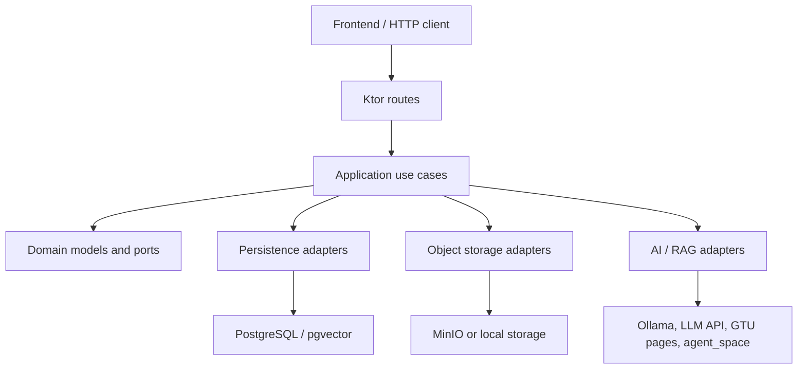

### 5.1. Реализация backend без agentic loop

Данный подраздел кратко описывает серверную функциональность, которая не относится непосредственно к agentic pipeline генерации ответа.

#### 5.1.1. Запуск приложения и конфигурация

Точка входа backend находится в `backend/app/src/main/kotlin/com/gtu/aiassistant/app/Main.kt`. При старте приложение выполняет несколько последовательных действий:

1. Читает runtime-конфигурацию из environment variables.
2. Собирает граф зависимостей через Koin.
3. Создает или проверяет дефолтного пользователя `admin@gmail.com`.
4. Синхронизирует embedding-профиль и при необходимости сбрасывает старые индексы.
5. Запускает scheduler для GTU knowledge ingestion.
6. Запускает scheduler для обработки пользовательских материалов.
7. Стартует Ktor Netty server на заданном host и port.

Конфигурация не зашита в коде. Через environment variables выбираются режимы AI, persistence, RAG, crawler, embedding, файлового хранения, OCR и agent_space. Например, `APP_PERSISTENCE_MODE` выбирает PostgreSQL или in-memory режим, `APP_FILE_STORAGE_MODE` выбирает MinIO или локальное хранение, `APP_AI_MODE` выбирает реальный OpenAI-compatible режим или memory-режим.

Сборка зависимостей находится в функции `appModule`. В ней создаются реализации портов: user ports, chat ports, material ports, artifact ports, RAG ports, embedding port, object storage port, password hashing port, JWT port и `GenerateMessagePort`. Благодаря этому use case работают с интерфейсами, а не с конкретными инфраструктурными классами.

#### 5.1.2. HTTP API и presentation layer

HTTP API реализован в модуле `backend/presentation`. Функция `configureApi` устанавливает Ktor plugins:

1. `CallLogging` - логирование входящих запросов.
2. `ContentNegotiation` - JSON-сериализация через kotlinx serialization.
3. `Authentication` - JWT-аутентификация под именем `auth-jwt`.

Основные маршруты описаны в `ApiRoutes.kt`. Публичными являются `/health`, `/api/auth/register` и `/api/auth/login`. Остальные маршруты находятся внутри `authenticate("auth-jwt")`, поэтому требуют bearer token.

Ключевые группы endpoint-ов:

1. `/api/auth/register` и `/api/auth/login` - регистрация и вход.
2. `/api/chats/with-agent` - создание чата с обычным JSON-ответом.
3. `/api/chats/with-agent/stream` - создание чата с потоковой генерацией.
4. `/api/chats/{chatId}/continue` - продолжение существующего чата.
5. `/api/chats/{chatId}/continue/stream` - продолжение чата с потоковой генерацией.
6. `/api/chats` и `/api/chats/{chatId}` - список и удаление чатов.
7. `/api/materials` - загрузка и список материалов.
8. `/api/materials/{id}` и `/api/materials/{id}/download` - получение метаданных и скачивание материала.
9. `/api/material-collections` - управление коллекциями материалов.
10. `/api/artifacts/{artifactId}/download` и `/api/artifacts/{artifactId}/view` - скачивание и просмотр сгенерированных артефактов.

Presentation layer не содержит бизнес-логики. Он принимает DTO, преобразует их в доменные команды, вызывает use case и переводит результат в HTTP status code и response DTO. Ошибки use case явно сопоставляются с HTTP-кодами: например, ошибки валидации дают `400 Bad Request`, отсутствие доступа - `403 Forbidden`, отсутствие объекта - `404 Not Found`, ошибки инфраструктуры - `500 Internal Server Error`.

#### 5.1.3. Авторизация и безопасность

Авторизация построена на JWT. При логине backend проверяет email и пароль, после чего выдает токен. В Ktor JWT plugin проверяется подпись токена, issuer и наличие subject. Из subject создается `UserId`, из claim `email` создается `UserEmail`. Если токен некорректный, endpoint возвращает `401 Unauthorized`.

Пароли не сохраняются в открытом виде. Для хеширования используется `Argon2HashPasswordPortImpl`, для проверки - `Argon2VerifyPasswordPortImpl`. Сами use case работают через порты `HashPasswordPort` и `VerifyPasswordPort`, поэтому алгоритм хеширования изолирован от прикладного слоя.

Изоляция данных реализуется на уровне команд и persistence-запросов. Чаты, материалы, коллекции и артефакты привязаны к пользователю. Например, при продолжении чата use case сначала загружает чат по id, затем проверяет `existingChat.ownedBy == command.userId`. При работе с материалами запросы используют `ownerUserId`, поэтому пользователь не может получить документы другого пользователя через обычный API.

#### 5.1.4. Use case для чатов

Чатовая логика реализована в `CreateChatWithAgentUseCaseImpl`, `ContinueChatWithAgentUseCaseImpl`, `ListChatsUseCaseImpl` и `DeleteChatUseCaseImpl`.

При создании нового чата use case выполняет следующие шаги:

1. Создает новый `ChatId`.
2. Проверяет историю для генерации: она не должна быть пустой, должна быть отсортирована по времени, сообщения должны чередоваться по отправителю, последнее сообщение должно быть от пользователя.
3. Проверяет выбранные фильтры материалов через `validateMaterialFilters`.
4. Вызывает `GenerateMessagePort` для получения ответа ассистента.
5. Создает доменный объект `Chat` из пользовательского сообщения и ответа AI.
6. Сохраняет чат через `SaveChatPort`.

При продолжении чата сначала загружается существующий чат, проверяется владелец, затем к истории добавляется новое сообщение пользователя. После генерации ответа чат обновляется через доменный метод `appendMessages`, версия увеличивается на единицу, а результат сохраняется.

Проверка фильтров материалов вынесена в отдельную функцию `validateMaterialFilters`. Она проверяет, что выбранные `collectionIds` и `documentIds` действительно существуют у текущего пользователя. Это важно для безопасности RAG-поиска: пользователь не может передать id чужого документа и заставить агент использовать его содержимое.

#### 5.1.5. Потоковая передача ответа

Для потоковой генерации используются endpoint-ы `/stream`, которые возвращают `application/x-ndjson`. Сервер пишет в ответ отдельные JSON-строки. В текущей реализации используются такие типы пакетов:

1. `{"h": true}` - heartbeat, отправляется периодически, чтобы соединение не выглядело зависшим.
2. `{"s": {"phase": "...", "message": "..."}}` - статус текущей стадии обработки.
3. `{"t": "..."}` - фрагмент текста ответа.
4. `{"d": ...}` - финальный объект чата.
5. `{"e": "..."}` - ошибка.

Для записи используется `respondTextWriter`, а параллельный heartbeat запускается корутиной. Запись защищается `ReentrantLock`, потому что токены, статусы и heartbeat могут приходить из разных участков выполнения. Если клиент закрывает соединение, `ClosedWriteChannelException` обрабатывается как отмена stream-доставки.

#### 5.1.6. Материалы пользователя и ingestion

Загрузка материалов реализована через `UploadMaterialUseCaseImpl`. Use case проверяет, что файл не пустой, не превышает лимит размера, имеет поддерживаемый формат и, если указана коллекция, что коллекция принадлежит пользователю. Поддерживаются `md`, `txt`, `pdf` и `docx`. После проверки файл сохраняется через `MaterialObjectStoragePort`, а в базе создается `MaterialDocument` со статусом `UPLOADED`.

Фактическое извлечение текста и построение векторов выполняется не в HTTP-запросе загрузки, а фоновым worker-ом. `MaterialIngestionScheduler` периодически вызывает `MaterialIngestionWorker.processOnce()`. Worker выбирает документы в статусе `UPLOADED`, переводит их в `PROCESSING`, читает файл из хранилища, извлекает текст, строит chunks, получает embeddings и сохраняет `material_chunks`. После успешной обработки документ получает статус `READY`; при ошибке - `FAILED` с текстом ошибки.

Для хранения файлов есть два режима: локальный и MinIO. В Docker Compose используется MinIO. Метаданные документа лежат в PostgreSQL, а бинарное содержимое файла хранится отдельно в object storage. Такая схема уменьшает нагрузку на базу и упрощает скачивание исходных файлов.

#### 5.1.7. Коллекции, артефакты и persistence

Коллекции материалов реализованы через отдельные use case: создание, список и удаление. Коллекция принадлежит пользователю и может использоваться как фильтр при RAG-поиске по загруженным материалам.

Сгенерированные артефакты хранятся через `StoreGeneratedArtifactPort`. Как и материалы, они имеют метаданные в базе и бинарное содержимое в object storage. Для HTML-артефактов есть отдельный endpoint просмотра, а остальные артефакты скачиваются как файлы.

Persistence layer имеет две реализации: in-memory и PostgreSQL. In-memory режим полезен для локальной разработки и тестов. PostgreSQL режим используется для полноценного запуска и включает таблицы пользователей, чатов, сообщений, цитат, материалов, chunk-ов, ingestion runs и артефактов.

#### 5.1.8. GTU knowledge ingestion

Общая база знаний GTU обновляется через `KnowledgeIngestionScheduler` и `KnowledgeIngestionService`. Scheduler может выполнить ingestion при старте, если включен `ingestOnStartup`, а затем запускать обновление раз в сутки в заданный час. Конфигурация задает sitemap URL, robots URL, разрешенные домены, максимальное число страниц за запуск и максимальный размер контента.

Этот механизм отделен от agent loop. Он заранее подготавливает `knowledge_documents` и `knowledge_chunks`, чтобы во время ответа ассистент мог быстро получить релевантные фрагменты через RAG-поиск.

### 5.2. Реализация agentic pipeline

В проекте agentic pipeline реализован классом `AgentGenerateMessagePortImpl` как полноценный tool-calling agent loop на базе Koog `AIAgent`. Порядок действий формируется внутри agent loop: модель получает список доступных tools, сама выбирает нужные вызовы, получает результаты через backend и может продолжать цикл до тех пор, пока не сформирует финальный ответ.

Ключевая идея реализации состоит в разделении ролей. LLM отвечает за reasoning и выбор следующего действия, а backend контролирует, какие tools вообще доступны, какие параметры принимает каждый tool и как безопасно исполняется запрос. Поэтому agentic loop является полноценным, но не произвольным: модель может вызывать только зарегистрированные функции, привязанные к выбранным пользователем источникам и настройкам приложения.

В `AgentToolRuntime.toolRegistry()` регистрируются следующие tools:

1. `current_time` - возвращает текущее серверное время в ISO-8601.
2. `gtu_knowledge_search` - ищет фрагменты во встроенной базе знаний GTU, если выбран источник `gtu`.
3. `uploaded_materials_search` - ищет по выбранным пользовательским материалам и возвращает inventory документов, если выбран источник `materials`.
4. `web_search` - ищет по разрешенным публичным web-страницам, если выбран источник `web`.
5. `artifact_create` - создает downloadable artifact, если в dependency graph подключен `AgentArtifactService`.

Таким образом набор tools является динамическим. Если пользователь выключил GTU, материалы или web, соответствующий tool не попадает в registry, и модель не может использовать этот источник. Это важно для соблюдения source policy: ограничения источников реализованы не только в prompt, но и на уровне фактически доступных функций.

`GtuPageOpenTool` присутствует в кодовой базе, но в текущем `appModule` не подключен и в `AgentToolRuntime.toolRegistry()` не регистрируется. Поэтому он не является активной частью текущего agent pipeline.

#### 5.2.1. Общая схема agentic pipeline

Общий поток генерации ответа выглядит следующим образом:

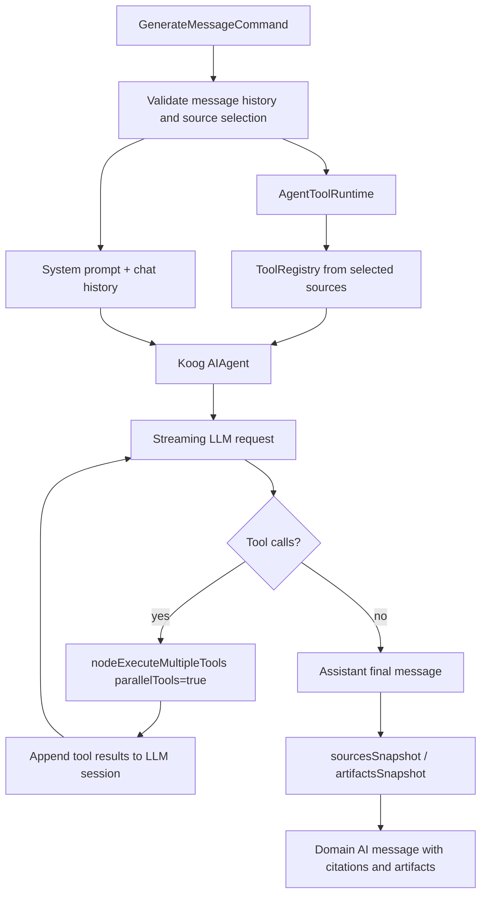

Входом в pipeline является `GenerateMessageCommand`. Он содержит историю сообщений, id пользователя, выбранные источники `ChatSources`, список выбранных коллекций и список выбранных документов. Такой объект создается application use case на основе HTTP-запроса.

Для обычного ответа вызывается метод `invoke`, для stream-ответа - метод `stream`. Оба метода используют один и тот же agent loop через `executeAgent`. Отличие только в callback-ах: в streaming режиме наружу передаются token delta и статусы tool-вызовов, а в обычном режиме callbacks пустые.

Agent создается в `createToolCallingAgent`. Для него задаются:

1. `RoutingLLMPromptExecutor` с round-robin выбором API key.
2. `LLModel` с OpenAI-compatible provider, моделью из конфигурации и context length `128000`.
3. `AIAgentConfig` с `maxAgentIterations = 100`.
4. `ToolRegistry`, созданный из выбранных источников.
5. Strategy `gtu_agent_tool_loop`, которая реализует цикл LLM/tool/result.

#### 5.2.2. Валидация входа

Pipeline начинается с проверки истории через `validateForMessageGeneration`. История должна удовлетворять нескольким правилам:

1. список сообщений не пустой;
2. сообщения отсортированы по времени;
3. отправители чередуются между пользователем и AI;
4. последнее сообщение принадлежит пользователю.

После этого проверяется выбор источников: должен быть включен хотя бы один источник. Если пользователь не выбрал ни GTU, ни материалы, ни web, генерация не запускается.

Такая валидация защищает LLM-вызов от некорректного состояния диалога. Модель получает не произвольный набор сообщений, а уже проверенную историю, где последнее сообщение действительно является запросом пользователя.

#### 5.2.3. Tool: поиск по базе знаний GTU

Если в `ChatSources` включен источник `gtu`, в registry добавляется tool `gtu_knowledge_search`. Модель вызывает его сама, когда ей нужна проверенная публичная информация GTU. Tool принимает query и `maxResults`; если query пустой, backend использует текст последнего пользовательского сообщения.

Внутри tool вызывает `GtuKnowledgeSearchTool.search`. Он создает `KnowledgeSearchQuery` с текстом запроса, лимитом результатов и минимальным score `0.22`, а затем вызывает порт `SearchKnowledgePort`.

В PostgreSQL-режиме этот порт реализован как `SearchKnowledgePortImpl`. Он строит embedding вопроса, загружает кандидаты из `knowledge_chunks`, считает гибридный score и возвращает `KnowledgeSearchHit`. Tool преобразует эти hits в `AgentSource` со следующими данными:

1. `title` - название источника;
2. `url` - ссылка на исходную страницу или документ;
3. `snippet` - короткий фрагмент текста;
4. `score` - итоговая оценка релевантности;
5. `sourceType=RAG` - тип цитаты для ответа.

Если поиск завершился ошибкой, tool возвращает в LLM текст вида `Error: GTU knowledge search failed: ...`. Это не прерывает весь agent loop. Модель видит ошибку как результат tool-вызова и должна объяснить пользователю, что выбранный источник не позволил подтвердить информацию.

#### 5.2.4. Tool: поиск по пользовательским материалам

Если включен источник `materials`, в registry добавляется tool `uploaded_materials_search`. Модель вызывает его перед ответом по загруженным файлам. Этот tool делает больше, чем простой vector search, потому что должен учитывать состояние и структуру пользовательских документов.

Порядок работы следующий:

1. Загружаются документы пользователя. Если переданы `documentIds`, выбираются только они. Если переданы `collectionIds`, список дополнительно фильтруется по коллекциям.
2. Из документов выбираются только те, которые находятся в статусе `READY`; только они могут использоваться для содержательных ответов.
3. Для READY-документов загружается outline через `FindMaterialDocumentOutlinePort`.
4. Создается inventory selected/uploaded материалов: id, title, original file name, ingestion status, ingestion error и outline.
5. Дополнительно ищутся релевантные секции по совпадению title секции с намерением запроса.
6. Выполняется vector/hybrid search через `SearchUserMaterialsPort`.
7. Section sources и search sources объединяются и дедуплицируются.

В результате tool возвращает в LLM текстовый блок `Uploaded material search results`. Он содержит не только найденные фрагменты, но и список выбранных документов. Это позволяет модели объяснить пользователю, какие материалы доступны, какие из них еще не READY и почему не все документы можно использовать для factual claims.

Для найденных фрагментов создаются `AgentSource` с `sourceType=USER_MATERIAL`. URL имеет внутренний формат `material://...`, но при преобразовании citation в API response для пользовательского материала URL заменяется на endpoint скачивания `/api/materials/{id}/download`.

#### 5.2.5. Tool: web search

Если включен источник `web`, в registry добавляется tool `web_search`. Решение вызвать web tool принимает модель на основе user request, source policy и tool-calling rules. Prompt отдельно говорит использовать `web_search` для latest, current или web-grounded claims, если этот tool доступен.

`GtuWebSearchTool` в режиме `DIRECT` работает так:

1. Из запроса извлекаются значимые query terms.
2. Загружается `robots.txt`; если его не удалось получить, используется политика allow all.
3. Загружается sitemap.
4. URL из sitemap фильтруются через `GtuUrlPolicy` и robots rules.
5. Кандидаты оцениваются по URL, приоритету раздела и времени изменения.
6. Для лучших кандидатов загружается HTML-страница.
7. Из HTML удаляются script, style, nav, header, footer, form и другие служебные элементы.
8. Из body строится текстовый snippet и score.
9. Возвращаются `AgentSource` с `sourceType=WEB`.

Этот tool не является произвольным интернет-поиском. Даже если модель решила вызвать `web_search`, backend ограничивает поиск разрешенными доменами, sitemap и robots-политикой. Это соответствует учебному сценарию и снижает риск попадания нерелевантных внешних источников.

#### 5.2.6. Agent loop и выполнение tool calls

Сам agent loop описан в `streamingToolStrategy()` и имеет граф `gtu_agent_tool_loop`.

Первый узел `stream_initial_llm` добавляет последнее пользовательское сообщение в LLM session и вызывает `requestStreamingAndSendResultsImpl`. Если модель сразу возвращает assistant message, loop завершается. Если модель возвращает один или несколько tool calls, управление переходит к `nodeExecuteMultipleTools(parallelTools = true)`.

После выполнения tools узел `stream_tool_results` добавляет результаты обратно в LLM session как tool messages:

```kotlin
appendPrompt {
    tool {
        results.forEach { result(it) }
    }
}
```

Затем LLM вызывается повторно. Если после tool results модель снова запрашивает tools, цикл повторяется. Если модель возвращает assistant message, этот текст становится финальным ответом. Защита от бесконечного цикла задается `maxAgentIterations = 100`.

Схема цикла:

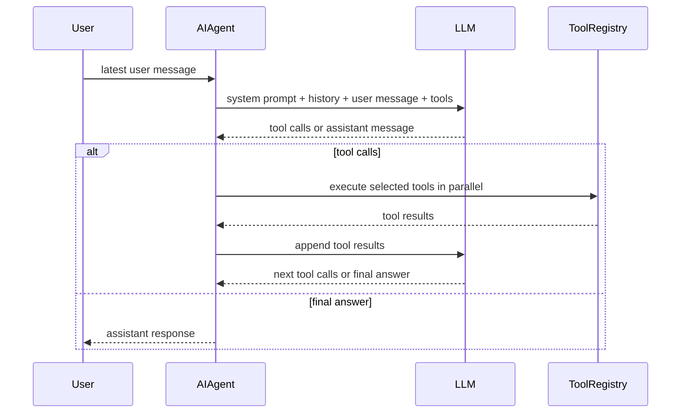

Для streaming frontend получает не только текстовые delta, но и статусы tool-вызовов. Через Koog event handler отправляются фазы `tool_call_started`, `tool_call_completed` и `tool_call_failed`. Поэтому пользователь видит, что агент не просто генерирует текст, а реально выполняет промежуточные действия.

#### 5.2.7. Сбор sources и формирование citations

Sources накапливаются во время реальных tool calls. Когда `gtu_knowledge_search`, `uploaded_materials_search` или `web_search` успешно возвращают sources, `AgentToolRuntime.rememberSources` сохраняет их во внутренний список.

После завершения agent loop вызывается `sourcesSnapshot()`. Он дедуплицирует sources по паре `url + snippet` и ограничивает список константой `MAX_SOURCES=6`. Позже из этих же sources создаются citations для доменного AI-сообщения. Citations дополнительно дедуплицируются по URL и также ограничиваются шестью элементами.

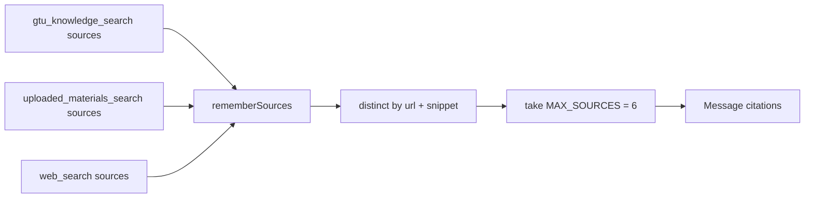

#### 5.2.8. Prompt assembly и tool-calling rules

Перед запуском агента создается history prompt `generate-gtu-agent-message`. Он состоит из system message и последних сообщений истории, максимум `MAX_HISTORY_MESSAGES=20`. Последнее пользовательское сообщение не добавляется в history prompt сразу, а передается в `agent.run(conversation.userMessage)`, чтобы agent strategy могла добавить его в LLM session как новый user input.

System prompt собирается функцией `ChatSources.agentSystemPrompt()` и состоит из нескольких частей:

1. Базовый `SYSTEM_PROMPT` ассистента GTU.
2. Правила выбранных источников из `ChatSources.promptRules()`.
3. Tool-calling rules, которые объясняют модели, когда вызывать tools.

Базовый prompt задает роль ассистента: помогать студентам Georgian Technical University, отвечать на языке пользователя, не переинтерпретировать GTU как другой университет, не выдумывать deadlines, prices, contacts, rules или personal student data. Также prompt явно перечисляет возможности приложения: source-grounded chat, uploaded user materials, optional web context и generated artifacts.

Правила источников зависят от выбора пользователя. Если какой-либо источник выключен, prompt прямо запрещает использовать этот источник и general knowledge для factual claims. Если включены только пользовательские материалы, prompt требует сказать, что загруженные материалы не содержат достаточно информации, если они действительно не дают ответа.

Tool-calling rules явно говорят модели:

1. У нее есть реальные function tools, и она должна использовать их для source-grounded factual information, uploaded-material content, current/web information, exact current time и file creation.
2. Для GTU factual claims нужно вызывать `gtu_knowledge_search`, если tool доступен и ответ не подтвержден историей.
3. Для uploaded files нужно вызывать `uploaded_materials_search` перед ответом из материалов.
4. Для latest/current/web-grounded claims нужно вызывать `web_search`, если tool доступен.
5. Если нужный source tool недоступен из-за выбора пользователя, нужно сказать, что выбранные источники не позволяют проверить информацию.
6. Если tool не нашел evidence, нельзя выдумывать детали.
7. `artifact_create` вызывается только при явном запросе на создание, сохранение, экспорт, загрузку, подготовку, рисование или генерацию файла.
8. Независимые tool calls желательно запрашивать в одном tool-calling step.

#### 5.2.9. Обращение к LLM и streaming

Обычный и streaming режимы используют общий Koog `AIAgent` и `requestStreamingAndSendResultsImpl`. Поэтому streaming является частью agent strategy, а не отдельной ручной реализацией SSE.

Порядок обращения к LLM следующий:

1. Создается prompt `generate-gtu-agent-message`.
2. В prompt добавляется system message с подготовленным контекстом.
3. Добавляются последние сообщения истории, максимум `MAX_HISTORY_MESSAGES=20`.
4. Для сообщений пользователя вызывается `user(...)`, для сообщений ассистента - `assistant(...)`.
5. Для OpenAI chat params включается `parallelToolCalls = true`.
6. Создается `AIAgent` с tool registry и strategy `gtu_agent_tool_loop`.
7. Агент запускается через `agent.run(conversation.userMessage)`.
8. LLM может вернуть assistant message либо tool calls.
9. Tool calls выполняются, результаты добавляются обратно в session, после чего LLM вызывается снова.
10. Финальный assistant text trim-ится и проверяется на непустую строку.

LLM model создается как `LLModel` с provider `OpenAI`, id из `APP_AI_MODEL`, capabilities `Completion` и `OpenAIEndpoint.Completions`, context length `128000`. Клиентом выступает `OpenAILLMClient` с `OpenAIClientSettings(baseUrl = config.baseUrl)`. Таким образом backend работает с OpenAI-compatible API, а конкретный provider задается конфигурацией.

Несколько API keys поддерживаются через `RoutingLLMPromptExecutor(RoundRobinRouter(clients))`. Для каждого ключа создается отдельный `OpenAILLMClient`, а router распределяет последовательные LLM-вызовы между клиентами.

В streaming режиме token delta отправляются наружу через Koog event `onLLMStreamingFrameReceived`. Если приходит `StreamFrame.TextDelta`, backend вызывает `onToken(frame.text)`. Статусы tool-вызовов отправляются через `onToolCallStarting`, `onToolCallCompleted` и `onToolCallFailed`.

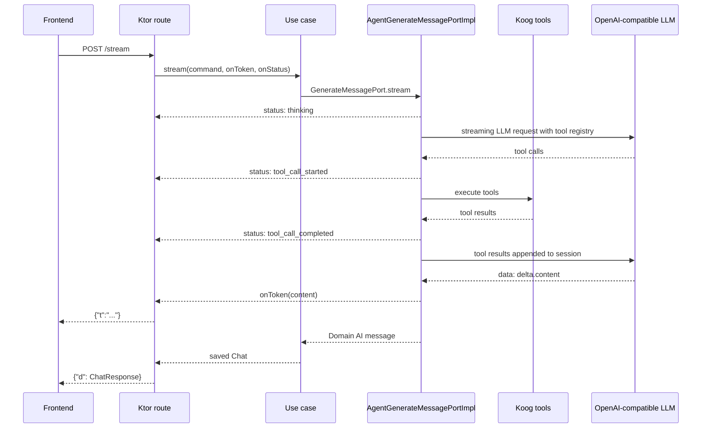

#### 5.2.10. Построение AI-сообщения

После получения текста создается доменное сообщение `Message`:

1. `id` генерируется через `UUID.randomUUID()`.
2. `originalText` содержит итоговый текст LLM.
3. `senderType` равен `AI`.
4. `createdAt` выбирается как текущее время, но не раньше чем `lastUserMessage.createdAt + 1 ms`.
5. `citations` создаются из найденных `AgentSource`.
6. `artifacts` добавляются, если в процессе agent loop был вызван `artifact_create` и файл был успешно создан.

Это сообщение возвращается в application use case. Use case уже отвечает за сохранение нового или обновленного чата.

### 5.3. Tool-driven генерация артефактов

Генерация артефактов является частью общего agentic loop и выполняется через function tool `artifact_create`. Модель сама решает, нужно ли создавать файл, и вызывает tool только при явном пользовательском запросе на create/save/export/download/prepare/draw/plot/generate.

Артефакт создается как действие внутри reasoning loop. Модель может сначала вызвать source tools, затем на основе найденного контекста вызвать `artifact_create`, получить подтверждение о созданном файле и только после этого сформировать финальный ответ пользователю.

#### 5.3.1. Tool `artifact_create`

В agent pipeline intent определяется самой моделью через tool-calling. В prompt есть правило: `artifact_create` можно вызывать только когда пользователь явно просит создать, сохранить, экспортировать, скачать, подготовить, нарисовать, построить или сгенерировать файл.

Tool `artifact_create` принимает:

1. `kind` - `text`, `html`, `docx` или `chart`.
2. `content` - полный Markdown-контент для `text`, `html`, `docx` либо brief/prompt для `chart`.
3. `fileName` - опциональное имя файла.

Поддерживаются четыре вида артефактов:

1. `TEXT` - Markdown/text файл.
2. `HTML` - self-contained HTML page.
3. `DOCX` - Word document.
4. `CHART` - PNG chart.

Для `TEXT`, `HTML` и `DOCX` нужен content, который модель передает прямо в tool call. Backend превращает его в `ArtifactDraft`. Для `CHART` draft не нужен: chart строится Python-кодом на основе чисел, найденных в переданном prompt.

#### 5.3.2. Создание артефакта через tool call

Метод `AgentToolRuntime.artifactCreate` нормализует `kind`, проверяет поддерживаемый тип и создает `ArtifactIntent`. Если передан `fileName`, backend очищает его через `normalizeArtifactFileName`: имя ограничивается по длине, не должно содержать `/`, `\`, `..` или управляющие символы, а расширение приводится к ожидаемому.

Для `TEXT`, `HTML` и `DOCX` tool content превращается в `ArtifactDraft.fromMarkdown`. Заголовок берется из первого Markdown heading `# ...`; если его нет, используется fallback title по типу артефакта.

Затем вызывается `AgentArtifactService.createArtifact`. Если создание прошло успешно, runtime сохраняет артефакт через `rememberArtifacts`, а tool возвращает модели artifact context с именем файла, content type, размером, download/open links и строкой verification.

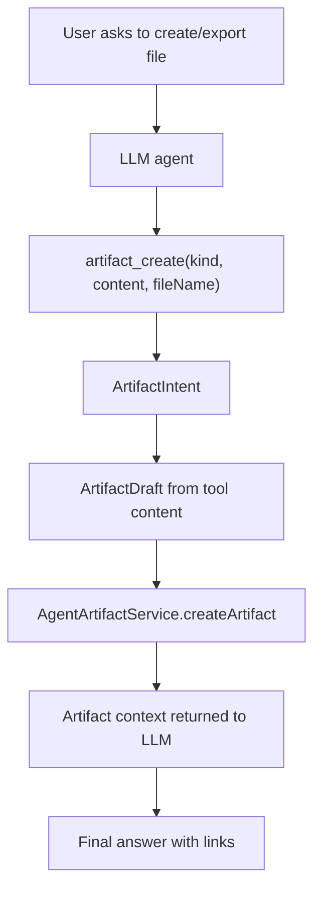

#### 5.3.3. agent_space как изолированный renderer

Для `TEXT` и `HTML` артефактов Python не нужен: Markdown напрямую сохраняется как файл, либо преобразуется в простую HTML-страницу.

Для `DOCX` и `CHART` используется `AgentSpaceClient`. Он отправляет HTTP POST на `/run` сервиса agent_space. В запросе указываются:

1. `mode` - в текущих artifact-сценариях используется `python`.
2. `code` - Python-код, сгенерированный backend.
3. `timeoutSeconds` - для artifact rendering используется 60 секунд.
4. `artifactPaths` - ожидаемый путь выходного файла.

Для DOCX backend генерирует Python-код с `python-docx`. В код передается base64-закодированный title и Markdown draft. Скрипт создает Word-документ, преобразует Markdown heading в заголовки, bullet lines в `List Bullet`, numbered lines в `List Number`, выставляет шрифт Arial 11 pt и сохраняет `assistant-document.docx`.

Для CHART backend генерирует Python-код с matplotlib. Из исходного prompt извлекаются числа; если чисел нет, используются значения по умолчанию. Скрипт строит bar chart и сохраняет `assistant-chart.png`.

agent_space возвращает список artifacts, где содержимое файла передается в base64. Backend декодирует base64, проверяет размер, сохраняет файл через `StoreGeneratedArtifactPort`, формирует download URL и, если artifact является viewable HTML, view URL.

#### 5.3.4. Связь артефакта с финальным ответом

Создание артефакта происходит до финального LLM-ответа, но не через отдельную сборку prompt. `ArtifactGenerationResult.context` возвращается как результат tool call `artifact_create`. В нем указано, что файл уже создан, его имя, content type, размер и download/open links. Базовый system prompt дополнительно говорит модели: если `artifact_create` вернул artifact context, надо упомянуть ссылки и кратко описать созданный файл.

Это означает, что финальный ответ пользователя не создает файл сам по себе. Файл создает backend во время tool call, а LLM после получения результата только объясняет пользователю результат и дает ссылки, которые уже существуют.

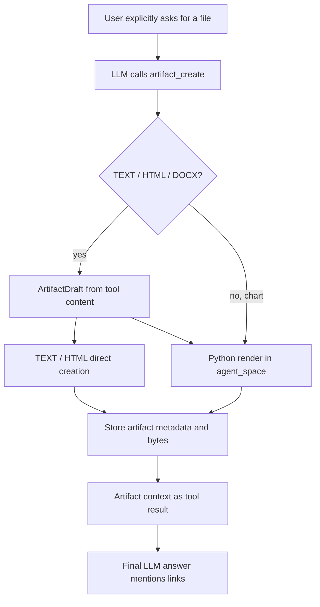

### 5.4. Ограничения текущей agentic реализации

Текущая реализация является полноценным agentic loop с function tools, но важно честно зафиксировать ее границы:

1. Модель выбирает tools сама, но только из backend-registered `ToolRegistry`; произвольные shell/Python/HTTP действия ей недоступны.
2. Доступность source tools зависит от выбора пользователя: если источник выключен, соответствующий tool не регистрируется.
3. Качество работы зависит от того, насколько корректно модель следует tool-calling rules и вызывает нужный tool перед factual claims.
4. `GtuPageOpenTool` не участвует в текущем pipeline, потому что не подключен в dependency graph и не регистрируется в `AgentToolRuntime`.
5. `agent_space` используется как изолированный executor/renderer для DOCX и PNG через backend-controlled `artifact_create`, а не как самостоятельный reasoning-agent и не как прямой tool для произвольного кода модели.
6. Web search остается ограниченным разрешенными доменами, sitemap и robots rules; это не общий поиск по интернету.
7. У agent loop есть верхняя граница `maxAgentIterations = 100`, чтобы защититься от бесконечных циклов tool calls.

Эти ограничения не являются ошибкой архитектуры. Наоборот, они делают систему более предсказуемой: источники контролируются backend-ом, пользовательские данные изолированы, prompt явно ограничивает factual claims, а выполнение кода для артефактов вынесено в отдельный контейнер с ограничениями.
